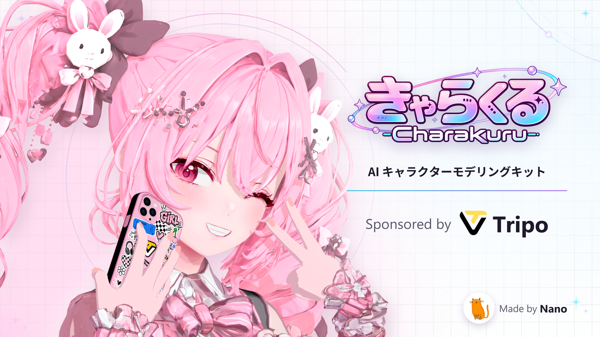
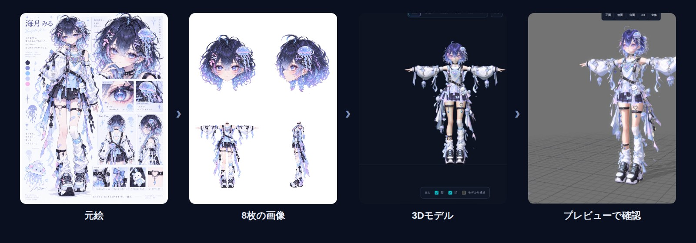
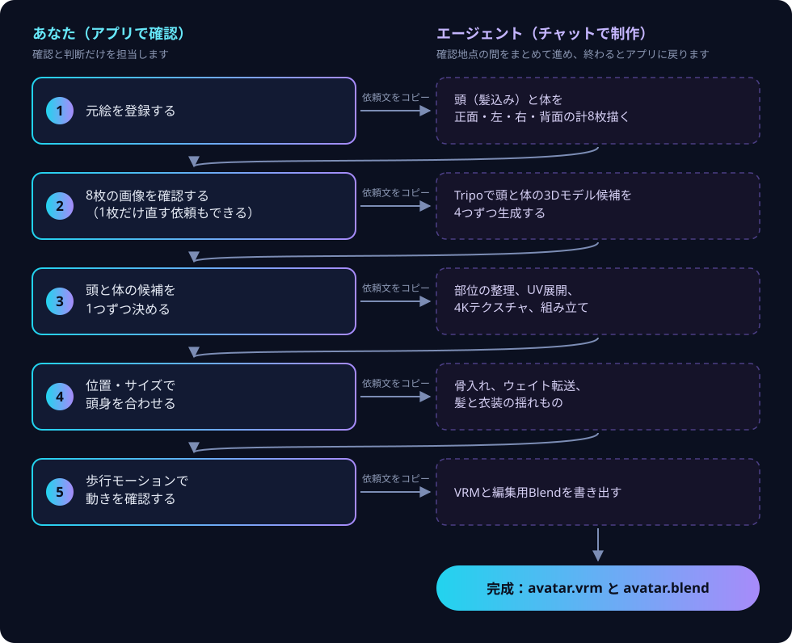
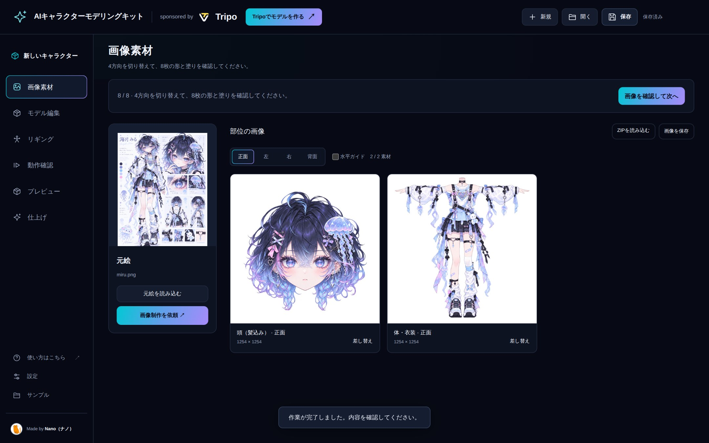
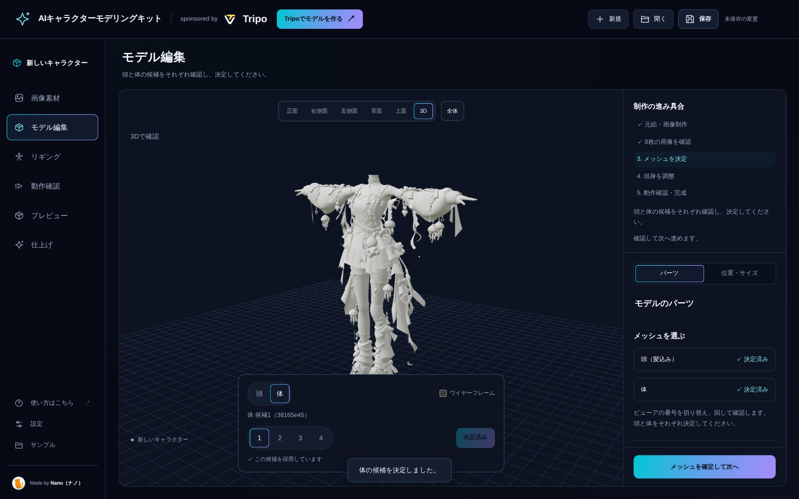
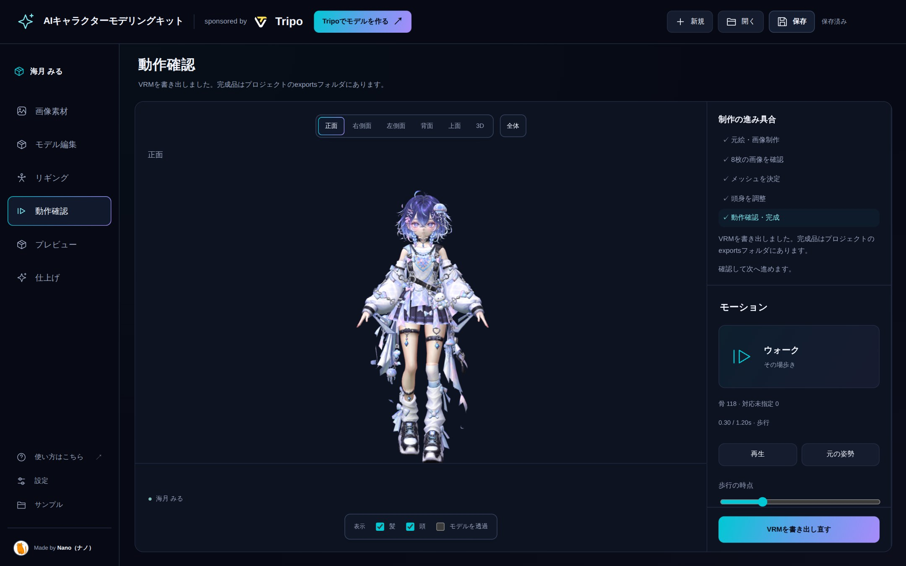
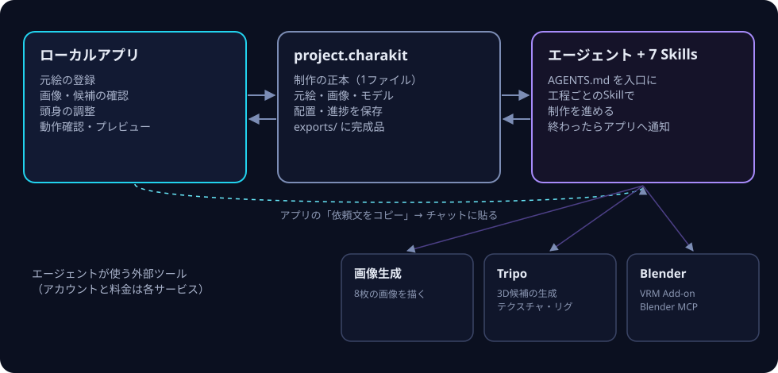

<p align="center">
  
</p>

<h1 align="center">きゃらくる / Charakuru</h1>

<p align="center">
  キャラクターのイラスト1枚から、AIエージェントと分担して VRM アバターを作るためのキットです。
</p>

<p align="center">
  <a href="README.md">English</a> ·
  <a href="docs/tutorial.ja.md"><b>チュートリアル</b></a> ·
  <a href="https://github.com/nanocle/Charakuru/releases">ダウンロード（Releases）</a> ·
  <a href="docs/license.ja.md">利用規約</a>
</p>

<p align="center">
  
  
  
  
</p>

## きゃらくるとは？

Tripoのスマートメッシュを活用した、キャラクターモデリング支援キットです。

現状Tripoだけでは高品質なキャラクターモデリングは難しく、かならずワークフローの研究やBlenderの知識などが必須でしたが、このキットはそれを解決します。

Nanoが発案した独自のワークフローをローカルアプリやエージェントのSkillsに詰め込み、それをユーザーが再現できる形で配布しています。
Tripoの操作やBlenderの操作、リギングなどの難しいセットアップをGPT-6.1 SolやGPT-6 Astraに任せることができます。

人間がまだ必要な工程もありますが、Blenderを扱う必要は無く、すべてローカルアプリの簡単な操作で実現できます。
AIエージェントへの丸投げほど非現実的でもなく、すべて人力ほど難しくもない、いい感じのバランスを目指した実用的なキットです！

敷居は少し高めかも。
「ここが難しい」とか「ここが分かりづらい」とかあればissueにご意見いただけますと幸いです！

全身が映っている1枚絵を用意するだけでVRMモデルの製作が行えます。

> [!WARNING]
> **このキットは開発途中です。**
>
> ドキュメントの整備が追いついていない部分や、不具合、まだ足りない機能があります。ご了承ください。
>
> **この説明はAIが書いたものです。**
>
> 人が読むには少し分かりにくいところがあります。配布ZIPを展開したフォルダを Codex や Claude Code などのコーディングエージェントに読み込ませて、エージェントと対話しながらキットを理解するのがおすすめです。
>
> 例：「README.ja.md と AGENTS.md を読んで、このキットで何ができるか教えて」

<p align="center">
  
</p>
<p align="center"><sub>作例：海月 みる。左から、元絵 → エージェントが描いた8枚の画像 → 3Dモデル → アプリのプレビュー。</sub></p>

---

## どんなふうに進むか

制作は、**アプリでの確認**と**チャットでの依頼**を5回くり返して進みます。

<p align="center">
  
</p>

1. アプリで確認したら「次へ」のボタンを押し、表示された**依頼文をコピー**します。
2. エージェント（Codex）とのチャットに貼り付けて送ります。
3. エージェントが作業を終えると、アプリが自動で最新の状態に切り替わり、次の確認地点で止まります。

ファイルの書き出しや読み込み、保存のやり直しは必要ありません。確認地点ではエージェントが勝手に先へ進まず、候補の決定もあなたが行います。

<table>
  <tr>
    <td width="33%"></td>
    <td width="33%"></td>
    <td width="33%"></td>
  </tr>
  <tr>
    <td><b>画像を確認</b><br><sub>頭（髪込み）と体を4方向ずつ。1枚だけ直す依頼もできます。</sub></td>
    <td><b>3Dの候補を選ぶ</b><br><sub>頭と体それぞれ4つの候補を回して見比べます。</sub></td>
    <td><b>動きを確認</b><br><sub>歩行モーションで肩や膝の曲がり方を確かめます。</sub></td>
  </tr>
</table>

## 設計の考え方

<p align="center">
  
</p>

- **人は判断、エージェントは作業。** あなたの担当は、元絵の登録、画像の確認、候補の決定、頭身の調整、動作確認の5つです。その間の分離・分類・書き出し・登録はエージェントが行い、あなたの宿題にしません。
- **確認地点で必ず止まる。** 候補をどれにするかをエージェントが決めることはありません。見た目の判断が必要な場面では、エージェントが画面を示して確認を求めます。
- **制作の記録は1つ。** プロジェクトは `project.charakit` 1つに保存され、日付付きのコピーや「final2」のようなファイルは増えません。アプリを同じフォルダから起動し直すと、前回の続きが開きます。
- **手元で動く。** アプリはパソコン上で起動するローカルアプリで、`npm install` なしで動きます。画像生成やTripoなどの外部サービスは、あなた自身のアカウントで使います。

## 必要なもの

| | 用途 |
| --- | --- |
| **Node.js 22 以上** | アプリの起動に使います。 |
| **デスクトップの Chromium 系ブラウザー**（Chrome など） | アプリを開きます。 |
| **Codex**（画像生成とブラウザー操作が使える環境） | 制作を担当するエージェントです。画像を描き、Tripoをブラウザーで操作し、Blenderを動かします。 |
| **Tripo のアカウント**（ログイン済みのブラウザー） | 3Dモデルの候補生成、テクスチャの再生成、リギングに使います。 |
| **Blender 5.2**、**VRM Add-on for Blender**、**Blender MCP** | ウェイト、揺れもの、VRMの書き出しに使います。 |
| **自分が使ってよい元絵** | PNG / JPEG / WebP、20MBまで。全身の分かる設定画のようなものが向いています。 |

外部サービスのアカウント、利用条件、料金・クレジットはそれぞれのサービスのものです。足りない準備は、エージェントが最初に確認して教えてくれます。

## はじめかた

このリポジトリには配布向けの文書と画像を格納しています。動作するアプリとルートの `AGENTS.md` は専用の配布ZIPに含まれます。

1. [Releases](https://github.com/nanocle/Charakuru/releases) から **`charakuru-1.0.2-….zip`** をダウンロードし、書き込みできる好きなフォルダに展開します。<br><sub>※ GitHubが自動で付ける「Source code」のZIPは説明文書と画像が入り、動作するキットは入っていません。</sub>
2. Codex で展開したフォルダを開き、次のように頼みます。

   ```text
   ルートAGENTS.mdを読んで、このキットでキャラクター制作を始めたい
   ```

3. エージェントが環境を確認してアプリを起動します。表示された `http://127.0.0.1:8766` をブラウザーで開けば準備完了です。

自分で起動する場合は、展開したフォルダで `npm start` を実行します。アプリは最初は英語で表示されます。左下の **Settings** を開き、**Language** の「日本語」ボタンで切り替えられます。

続きは **[チュートリアル](docs/tutorial.ja.md)** で、1体目を作り終えるまでの手順を画面つきで説明しています。

新しい依頼文は、Windows の Codex が旧形式の `start` とURLをURL起動命令と誤判定しないよう、開始命令に `begin` を使います。古い依頼文が `blocked by policy` と拒否された場合は、[復旧手順](docs/tutorial.ja.md#windows-の-codex-で開始コマンドが拒否される)を確認し、更新済みキットのアプリから依頼文をコピーし直してください。

## キットの中身

| | |
| --- | --- |
| `AGENTS.md` | エージェントが最初に読む入口です。必要な環境、工程、保存のルールをまとめています。 |
| `public/`、`server.mjs` | 確認用のローカルアプリです。 |
| `skills/` | 工程ごとの7つのSkillsです。 |
| `scripts/` | エージェントがプロジェクトを更新するためのスクリプトです。 |
| `assets/donor/weighted-body.blend` | ウェイト転送に使う素体です。 |
| `docs/` | チュートリアル、プレビューの使い方、日英の利用規約の解説です。 |

<details>
<summary>7つのSkills</summary>

| Skill | 使う場面 |
| --- | --- |
| `charakit-project` | プロジェクトファイルの検査・読み込み・更新 |
| `character-parts-images` | 元絵から頭（髪込み）と体を4方向ずつ、計8枚描く |
| `character-material-brushup` | 形とデザインを保ったまま、塗りと質感を仕上げる |
| `tripo-agent-workflow` | Tripoでの候補生成、部位の分類、UV展開とテクスチャ、リギング |
| `avatar-weight-transfer` | 揺れものの分離と、素体からのウェイト転送 |
| `avatar-spring-setup` | 髪や衣装の揺れもの設定と、VRMの書き出し・確認 |
| `tripo-character-setup` | 関節の目印を自分で置く詳しいリギング（選んだときだけ使う） |

</details>

## 現在の制約

- 依頼文をコピーしただけではエージェントは動きません。チャットに貼って送ってください。作業中はアプリを開いたままにします。
- 新しく作るキャラクターは通常の顔で、視線は固定です。表情の切り替えや視線の動きは含みません。
- アプリの歩行確認は、骨と肌の動きを確かめるためのものです。揺れものの物理は、書き出したVRMで確認します。
- プレビューのトゥーン表示や光の調整は見た目の確認用で、VRMには反映されません。VRMを書き出し直すときはエージェントに依頼します。
- 持ち運ぶときは、`project.charakit` だけでなく、完成した VRM や Blend ファイルの入った制作フォルダもまとめて保管してください。

## 利用規約

非商用・商用を問わず、以下の条件内であれば自由にお使いいただけます。

キットの再配布や、キットのコードを利用者へ提供する製品・サービスへの組み込みは、事前にNanoまでご相談ください。

私的な改変や複製はOKです。

同梱素材だけを抜き出して外部へ持ち出したり、再配布したりすることは禁止です。

法律で認められる範囲で、このキットの利用によって発生した損害の責任を負いません。

事業全体の年商と累計調達資金が**どちらも1億円未満**であれば、通常のライセンスの条件内で、別途契約や登録なしに利用できます。**どちらかが1億円以上**の場合は、商用・業務利用を開始・継続する前に、Nanoを窓口として権利者等との別途の書面によるライセンス契約を締結してください。売上と調達資金は合算しません。

年商は**直近の終了した会計年度**で判定します。会計年度がない場合は直近12か月、まだ会計年度が終了していない場合は開業後の実売上（最大直近12か月）を使い、開業後12か月未満の場合や短い初年度は年換算しません。累計調達資金は年度に関係なく受領時に再確認します。詳しい計算方法と契約のタイミングは[利用規約の解説](docs/license.ja.md)をご覧ください。

正式なライセンスは[こちら](LICENSE)をご覧ください。

[第三者ライセンス](THIRD_PARTY_NOTICES.md)もご覧ください。

## 不具合の報告

うまくいかなかった工程や改善案は、[報告方法](CONTRIBUTING.md) に沿って [Issues](https://github.com/nanocle/Charakuru/issues) へお願いします。プルリクエストは受け付けていません。

---

<p align="center"><sub>Made by Nano（ナノ） · sponsored by Tripo</sub></p>
