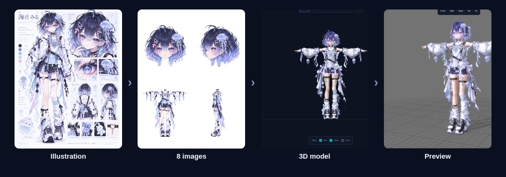
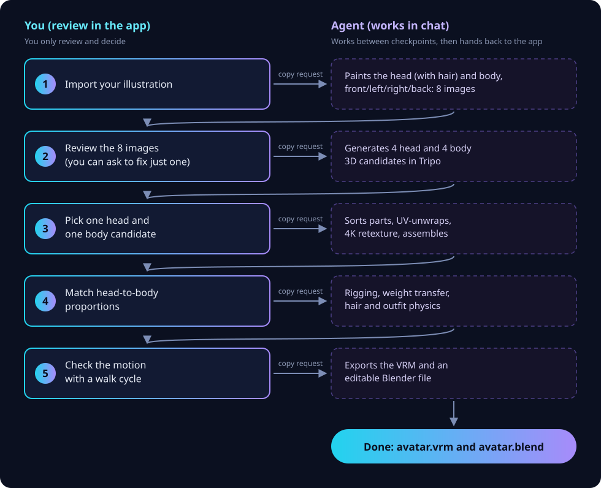
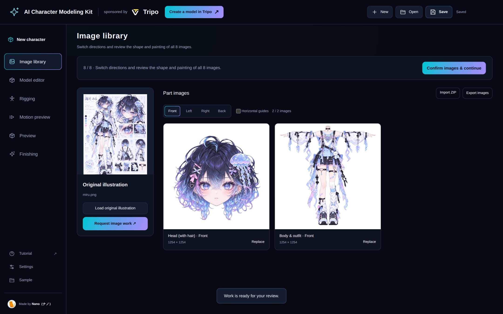
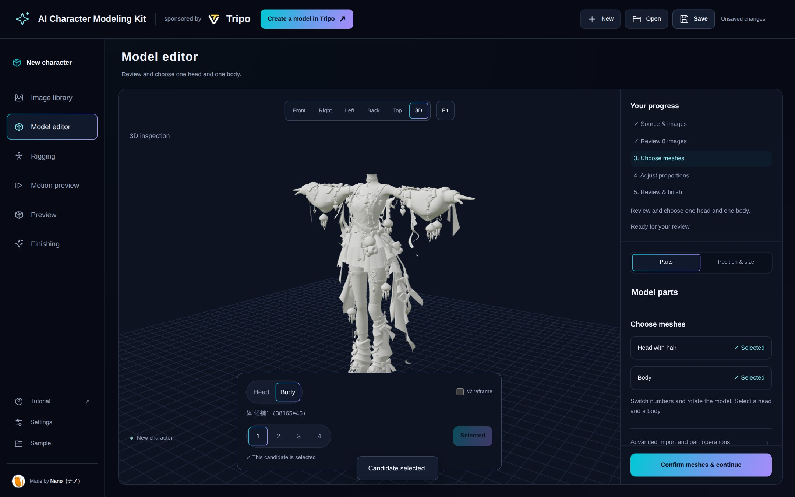
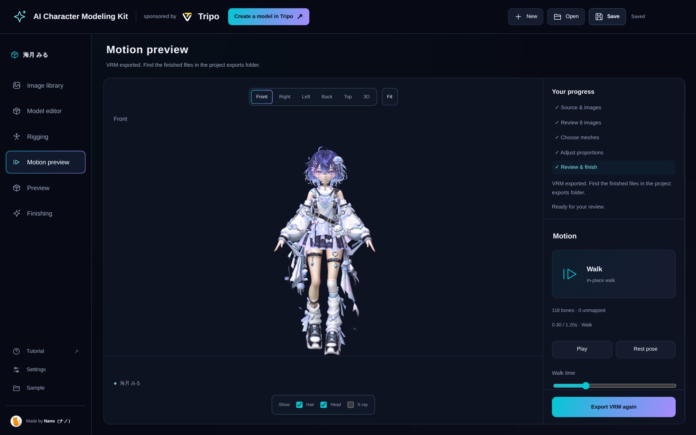
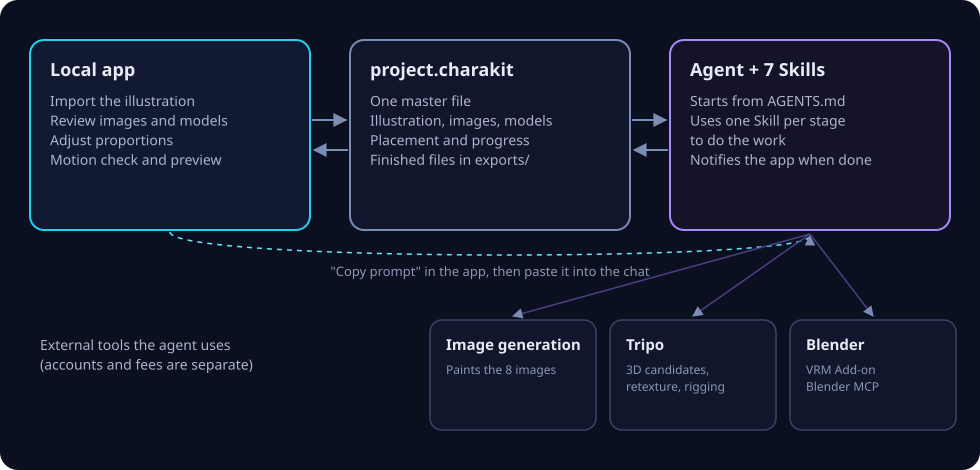

<p align="center">
  
</p>

<h1 align="center">Charakuru / きゃらくる</h1>

<p align="center">
  A kit for turning one character illustration into a VRM avatar, sharing the work with an AI agent.
</p>

<p align="center">
  <a href="README.ja.md">日本語</a> ·
  <a href="docs/tutorial.md"><b>Tutorial</b></a> ·
  <a href="https://github.com/nanocle/Charakuru/releases">Download (Releases)</a> ·
  <a href="docs/license.md">Terms of Use</a>
</p>

<p align="center">
  
  
  
  
</p>

## What is Charakuru?

A character modeling support kit powered by Tripo's Smart Mesh.

Creating high-quality character models with Tripo alone has been difficult, making workflow research and Blender knowledge essential. This kit solves that problem.

It packages an original workflow devised by Nano into a local app and agent Skills, distributing it in a form users can reproduce.
You can leave Tripo and Blender operations, rigging, and other complex setup work to GPT-6.1 Sol or GPT-6 Astra.

Some steps still need a human, but you don't need to operate Blender yourself. Everything can be done through simple controls in the local app.
This practical kit aims for a good balance: more realistic than handing everything off to an AI agent, and easier than doing everything by hand!

The learning curve might be a little steep.
If anything feels difficult or unclear, we'd appreciate your feedback in an issue!

All you need is a single full-body illustration to create a VRM model.

> [!WARNING]
> **This kit is still in development.**
>
> Some documentation hasn't caught up yet, and there are bugs and missing features. Thank you for your understanding.
>
> **These docs were written by AI.**
>
> They can be a little hard for people to read. We recommend opening the extracted distribution ZIP folder in a coding agent such as Codex or Claude Code, and learning about the kit by talking with the agent.
>
> For example: "Read README.md and AGENTS.md and tell me what this kit can do."

<p align="center">
  
</p>
<p align="center"><sub>Example: 海月 みる (Miru Umitsuki). Left to right: illustration → 8 images painted by the agent → 3D model → in-app preview.</sub></p>

---

## How it feels to use

You go back and forth between **reviewing in the app** and **asking in the chat**, five times.

<p align="center">
  
</p>

1. When you're happy with a step, press the app's continue button and **copy the request** it shows.
2. Paste it into your chat with the agent (Codex) and send it.
3. When the agent finishes, the app switches to the new state on its own and stops at the next checkpoint.

There's no exporting, importing or re-saving files by hand. The agent never moves past a checkpoint on its own, and you are the one who picks the candidates.

<table>
  <tr>
    <td width="33%"></td>
    <td width="33%"></td>
    <td width="33%"></td>
  </tr>
  <tr>
    <td><b>Review images</b><br><sub>Head (with hair) and body, four views each. You can ask to fix a single image.</sub></td>
    <td><b>Pick 3D candidates</b><br><sub>Rotate and compare four candidates for the head and four for the body.</sub></td>
    <td><b>Check the motion</b><br><sub>Watch shoulders and knees bend in a walk cycle.</sub></td>
  </tr>
</table>

## Design ideas

<p align="center">
  
</p>

- **You decide, the agent works.** You handle five things: importing the illustration, reviewing images, choosing candidates, adjusting proportions and checking motion. Splitting, sorting, exporting and registering files is the agent's job, not homework for you.
- **It always stops at checkpoints.** The agent never picks a candidate for you. When something needs a visual judgement, it shows you the spot and asks.
- **One project file.** The project lives in a single `project.charakit`. No dated copies or "final2" files pile up. Restarting the app from the same folder reopens where you left off.
- **Runs on your computer.** The app runs locally and starts without `npm install`. External services such as image generation and Tripo are used with your own accounts.

## What you need

| | Used for |
| --- | --- |
| **Node.js 22 or later** | Running the app. |
| **A desktop Chromium-based browser** (Chrome, etc.) | Opening the app. |
| **Codex** with image generation and browser control | The agent that does the work. It paints images, operates Tripo in the browser and drives Blender. |
| **A Tripo account** (signed in in the browser) | 3D candidates, retexturing and rigging. |
| **Blender 5.2**, **VRM Add-on for Blender**, **Blender MCP** | Weights, physics and VRM export. |
| **An illustration you're allowed to use** | PNG / JPEG / WebP, up to 20 MB. A full-body character sheet works well. |

Accounts, terms and fees for external services are your own. The agent checks what's missing at the start and tells you.

## Getting started

This repository contains distribution documentation and images. The runnable app and root `AGENTS.md` are included in the dedicated distribution ZIP.

1. Download **`charakuru-1.0.1-….zip`** from [Releases](https://github.com/nanocle/Charakuru/releases) and extract it to any folder you can write to.<br><sub>GitHub's automatic "Source code" archive contains these documents and images, not the runnable kit.</sub>
2. Open the extracted folder in Codex and ask:

   ```text
   Read the root AGENTS.md and help me start creating a character with this kit.
   ```

3. The agent checks your setup and starts the app. Open `http://127.0.0.1:8766` in your browser and you're ready.

To start it yourself, run `npm start` in the extracted folder.

Then follow the **[tutorial](docs/tutorial.md)**, which walks through your first avatar screen by screen.

New agent requests use the `begin` command to avoid Codex on Windows mistaking the old `start` argument and a URL for a URL launch. If an old request is rejected with `blocked by policy`, see the [recovery steps](docs/tutorial.md#a-start-command-is-blocked-by-policy-in-codex-on-windows) and copy a new request from the updated kit.

## What's in the kit

| | |
| --- | --- |
| `AGENTS.md` | The agent's starting point: requirements, stages and saving rules. |
| `public/`, `server.mjs` | The local review app. |
| `skills/` | The seven Skills, one per stage. |
| `scripts/` | Scripts the agent uses to update the project. |
| `assets/donor/weighted-body.blend` | The base body used for weight transfer. |
| `docs/` | The tutorial, the preview guide and plain-language terms in English and Japanese. |

<details>
<summary>The seven Skills</summary>

| Skill | Used for |
| --- | --- |
| `charakit-project` | Checking, reading and updating the project file |
| `character-parts-images` | Painting the head (with hair) and body in four views: 8 images |
| `character-material-brushup` | Finishing the painting and materials without changing the design |
| `tripo-agent-workflow` | Tripo candidates, part sorting, UV and retexturing, rigging |
| `avatar-weight-transfer` | Separating swinging parts and transferring weights from the base body |
| `avatar-spring-setup` | Hair and outfit physics, VRM export and checking |
| `tripo-character-setup` | Detailed rigging from joint markers you place (only when you choose it) |

</details>

## Current limitations

- Copying a request does not start the agent. Paste it into the chat and send it, and keep the app open while it works.
- New characters have a neutral face with a fixed gaze. Expressions and eye movement are not included.
- The in-app walk check is for bones and skin deformation. Physics is checked in the exported VRM.
- Toon shading and lighting in the preview are for viewing only and don't change the VRM. To export the VRM again, ask the agent.
- The UI is in English and Japanese, but the request text you copy to the agent is in Japanese. The agent reads it either way.
- When moving your work, keep the whole project folder with the finished VRM and Blend files, not just `project.charakit`.

## Terms of Use

You may freely use the kit for non-commercial and commercial purposes within the following conditions.

Contact Nano in advance before redistributing the kit or integrating it into a product or service that provides kit code to users.

Private modification and copying are OK.

You must not extract bundled assets alone to take them outside the kit or redistribute them separately.

To the extent permitted by law, we accept no liability for damage arising from use of this kit.

If your entire business's annual revenue and cumulative funding are **both below ¥100 million**, you may use the Kit within the standard License conditions without a separate agreement or registration. If **either is ¥100 million or more**, contact Nano and obtain a separate written license agreement with the Licensor or an authorized representative before starting or continuing commercial or business use. Revenue and funding are not added together.

Assess annual revenue using the **most recently completed fiscal year**. If there is no defined fiscal year, use the preceding twelve months; if no fiscal year has yet ended, use actual revenue since the business began, limited to the preceding twelve months. Do not annualize revenue for a business operating for less than twelve months or for a short initial fiscal year. Reassess cumulative funding when funds are received, regardless of the fiscal year. See [Terms of Use explained](docs/license.md) for calculation details and agreement timing.

Read the formal license [here](LICENSE).

See also [third-party notices](THIRD_PARTY_NOTICES.md).

## Reporting issues

Please report problems and ideas through [Issues](https://github.com/nanocle/Charakuru/issues), following [the reporting guide](CONTRIBUTING.md). Pull requests are not accepted.

---

<p align="center"><sub>Made by Nano (ナノ) · sponsored by Tripo</sub></p>
