# チュートリアル：1体目のVRMアバターを作る

[README](../README.ja.md) · [English](tutorial.md)

> [!WARNING]
> **このキットは開発途中です。**
>
> ドキュメントの整備が追いついていない部分や、不具合、まだ足りない機能があります。ご了承ください。
>
> **この説明はAIが書いたものです。**
>
> 人が読むには少し分かりにくいところがあります。配布ZIPを展開したフォルダを Codex や Claude Code などのコーディングエージェントに読み込ませて、エージェントと対話しながらキットを理解するのがおすすめです。
>
> 例：「README.ja.md と AGENTS.md を読んで、このキットで何ができるか教えて」

このチュートリアルでは、元絵を1枚用意してから、VRMアバターが完成するまでを順番に説明します。作例のキャラクターは「海月 みる」です。

各ステップは2つに分かれています。

- **👤 あなたの操作**：アプリでボタンを押したり、見た目を確認したりする手順です。順番どおりに進めてください。
- **🤖 エージェントの作業**：依頼文を渡したあと、エージェントが何をしているかの説明です。読むだけで大丈夫です。

<p align="center"></p>

## 目次

0. [準備するもの](#0-準備するもの)
1. [キットを起動する](#1-キットを起動する)
2. [元絵を登録して、8枚の画像を頼む](#2-元絵を登録して8枚の画像を頼む)
3. [8枚の画像を確認する](#3-8枚の画像を確認する)
4. [頭と体の3D候補を決める](#4-頭と体の3d候補を決める)
5. [頭身を合わせる](#5-頭身を合わせる)
6. [動きを確認する](#6-動きを確認する)
7. [完成したVRMを確かめる](#7-完成したvrmを確かめる)
- [保存と再開](#保存と再開) · [困ったとき](#困ったとき)

---

## 0. 準備するもの

[README の「必要なもの」](../README.ja.md#必要なもの)にある環境を用意します。足りないものはステップ1でエージェントが確認してくれるので、全部そろっていなくても始められます。

あわせて、次の2つを用意しておくとスムーズです。

- **元絵**：PNG / JPEG / WebP、20MBまで。髪型、衣装、靴まで全身が分かる絵が向いています。顔のアップや背面がのった設定画でも使えます。自分が使ってよい絵を選んでください。
- **VRMに入れる情報**：モデル名、作者名、利用条件（ほかの人が使ってよいか、商用利用、再配布、改変など）。最後のステップでエージェントに聞かれます。

## 1. キットを起動する

**👤 あなたの操作**

1. [Releases](https://github.com/nanocle/Charakuru/releases) から `charakuru-1.0.2-….zip` をダウンロードし、書き込みできるフォルダに展開します。「Source code」のZIPではありません。
2. Codex で展開したフォルダを開き、次のように頼みます。
   ```text
   ルートAGENTS.mdを読んで、このキットでキャラクター制作を始めたい
   ```
3. エージェントがアプリを起動したら、`http://127.0.0.1:8766` をブラウザーで開きます。
4. 表示が英語の場合は、左下の **Settings** を開き、**Language** の「日本語」を押します。

**🤖 エージェントの作業**

`AGENTS.md` を読み、Node.js、画像生成、ブラウザー操作、Blender などが使えるかを確認します。足りないものがあれば教えてくれます。そのあとアプリを起動します。アプリやTripoを開くときは、使用中のブラウザーと既存のタブを優先します。対象タブがなければ同じブラウザーに追加し、ブラウザーが開いていない場合だけ新しく起動します。操作の接続が必要な場合は、その接続を案内します。

<p align="center">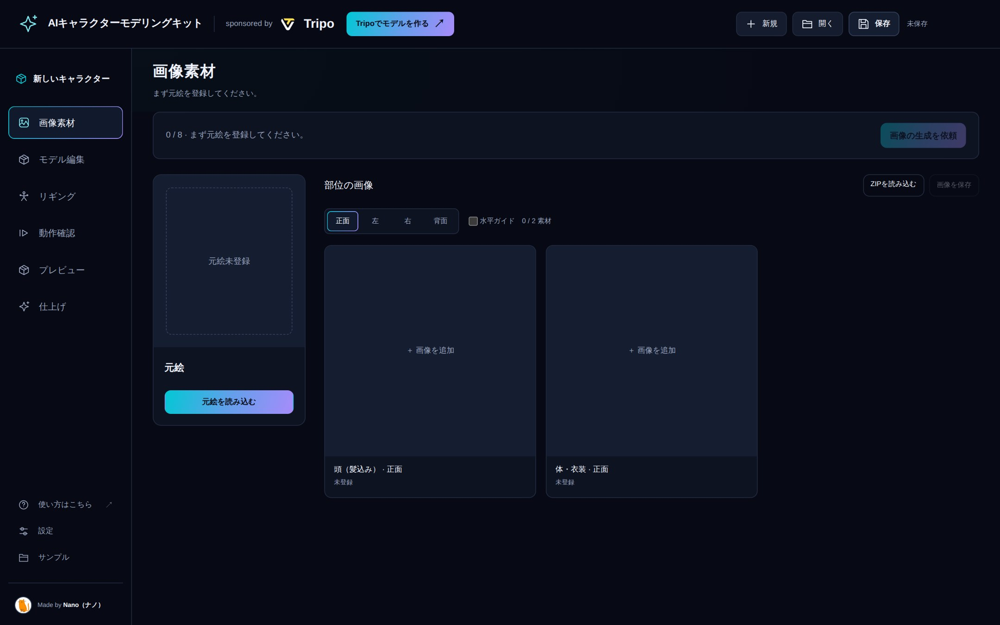</p>

左のメニューが制作の段階です。上から **画像素材 → モデル編集 → リギング → 動作確認 → プレビュー → 仕上げ** の順に進みます。右上の **新規・開く・保存** でプロジェクトを扱います。

> [!TIP]
> 自分で起動する場合は、展開したフォルダで `npm start` を実行します。`npm install` は必要ありません。

### 依頼のしかた（すべてのステップで共通）

このあとの各ステップは、同じ手順で依頼します。

1. 画面右上などにある「次へ」系のボタン（例：**画像の生成を依頼**）を押すと、依頼文のウィンドウが開きます。
2. **依頼文をコピー** を押します。
3. Codex のチャットに貼り付けて送ります。**コピーしただけではエージェントは動きません。**
4. 作業中はアプリを開いたままにしておきます。画面の見出しの下に、エージェントの進み具合が表示されます。
5. 終わると「作業が完了しました。内容を確認してください。」と表示され、アプリが自動で新しい状態になります。

<p align="center">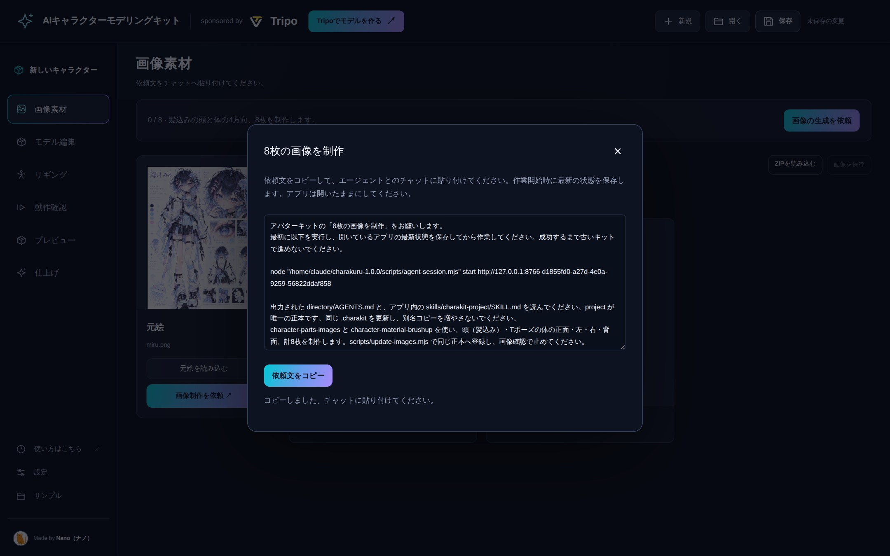</p>

## 2. 元絵を登録して、8枚の画像を頼む

**👤 あなたの操作**

1. 左のメニューで **画像素材** を開きます。
2. 「元絵」の欄の **元絵を読み込む** を押し、元絵のファイルを選びます。
3. **画像の生成を依頼**（右上）または **画像制作を依頼**（元絵の下）を押し、依頼文をコピーしてチャットに送ります。

<p align="center">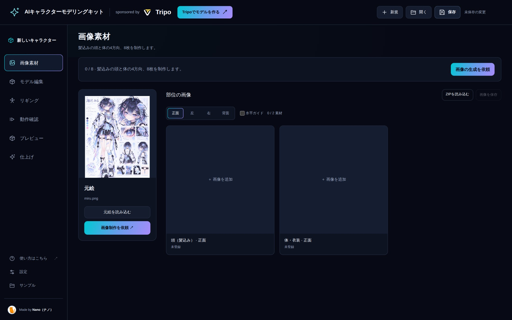</p>

**🤖 エージェントの作業**

元絵をもとに、**頭（髪込み）** と **衣装込みの体** を、それぞれ正面・左・右・背面の4方向で描きます。合計8枚です。

- 頭は顔の傾きを直し、口を閉じた落ち着いた表情にそろえます。
- 体は腕を横に広げた T ポーズにします。
- 髪、肌、衣装の塗りを、完成した立ち絵と同じくらいの密度に仕上げます。
- 描いた画像は、使ったプロンプトと一緒にプロジェクトへ登録します。

<p align="center">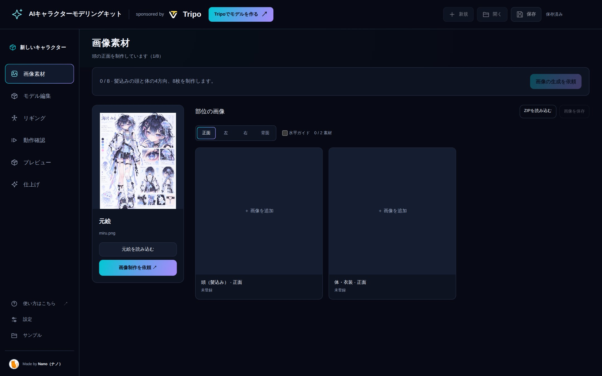</p>

## 3. 8枚の画像を確認する

**👤 あなたの操作**

1. 作業が終わると、頭と体の画像が並びます。上の **正面・左・右・背面** で向きを切り替えて、8枚すべてを見ます。
2. 気になる点がないか確認します。たとえば次のようなところです。
   - 髪の長さや毛先、髪飾りが元絵と合っているか
   - 衣装の柄や色、左右で違う部分の位置が合っているか
   - 頭の画像に体が混ざっていないか、体の画像に後ろ髪が残っていないか
3. 1枚だけ直したいときは、その画像をクリックして拡大し、**Astraに修正を依頼** を押します。依頼文をコピーしてチャットに貼り、**どこをどう直してほしいかを書き足して**送ります。
4. 8枚に問題がなければ、**画像を確認して次へ** を押し、依頼文をチャットに送ります。

<p align="center"></p>

<table>
  <tr>
    <td width="50%">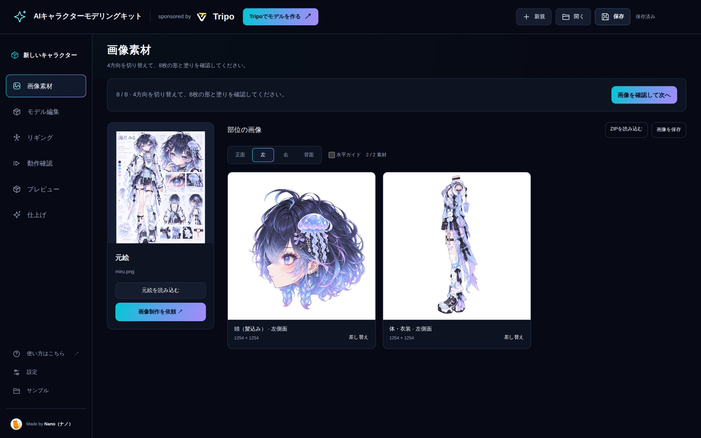</td>
    <td width="50%">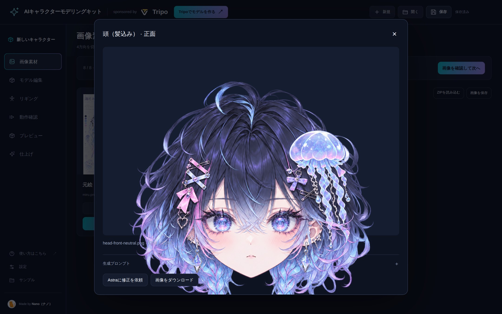</td>
  </tr>
  <tr>
    <td><sub>向きを「左」に切り替えたところ</sub></td>
    <td><sub>クリックで拡大。ここから1枚の修正を頼めます</sub></td>
  </tr>
</table>

> [!NOTE]
> 各画像の **差し替え** で、自分で用意した画像に置き換えることもできます。

**🤖 エージェントの作業**

Tripo をブラウザーで操作し、4方向の画像から **頭と体の3Dモデル候補を4つずつ** 生成します。できた候補をダウンロードしてプロジェクトに登録し、あなたが選ぶところで止まります。Tripo のクレジットはこの段階から使われます。

## 4. 頭と体の3D候補を決める

**👤 あなたの操作**

1. **モデル編集** の画面に候補が表示されます。下のパネルで **頭** を選び、**1〜4** の番号を切り替えて見比べます。
2. ドラッグで回転、上の **正面・右側面・左側面・背面・上面・3D** で向きを変えられます。**ワイヤーフレーム** をオンにすると面の細かさが見えます。
3. いちばん良い候補を表示した状態で **この候補に決定** を押します。
4. **体** に切り替えて、同じように1つ決めます。
5. 右側の「メッシュを選ぶ」で頭と体の両方が「決定済み」になったら、**メッシュを確定して次へ** を押し、依頼文をチャットに送ります。

<table>
  <tr>
    <td width="50%">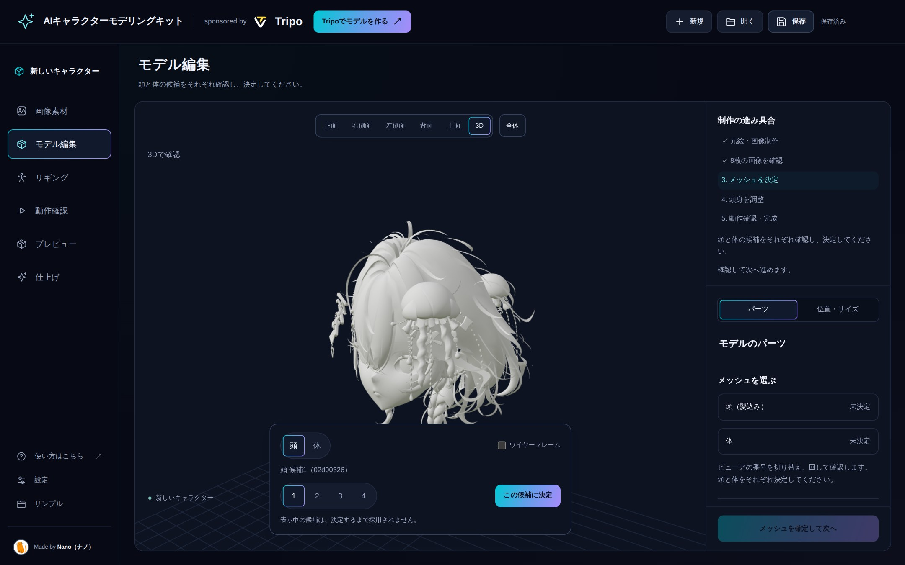</td>
    <td width="50%"></td>
  </tr>
  <tr>
    <td><sub>番号を切り替えて候補を見比べる</sub></td>
    <td><sub>頭と体が「決定済み」になったら次へ</sub></td>
  </tr>
</table>

> [!NOTE]
> 番号を切り替えて表示しただけでは採用されません。**この候補に決定** を押したものだけが使われます。

**🤖 エージェントの作業**

選ばれた頭と体を、仕上げに向けて整えます。

- Tripo で部位を分け、顔・髪・衣装などに分類します。
- テクスチャを最大7つのまとまりに分け、それぞれの参照画像を描きます。
- Tripo で UV を展開し、4K のテクスチャを作り直します。
- 部位を組み立てて、プロジェクトに登録します。

形がつながっていて分けられない部分があると、エージェントが画像で示して進め方を聞いてきます。チャットで答えてください。

<p align="center">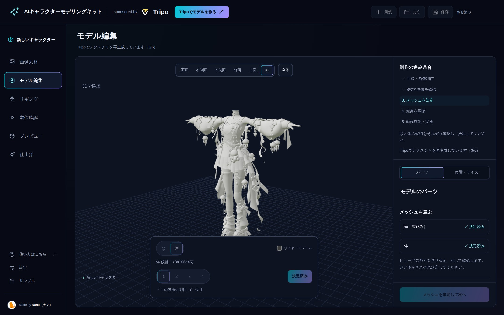</p>

## 5. 頭身を合わせる

**👤 あなたの操作**

1. **モデル編集** の **位置・サイズ** タブを開きます。
2. **調整するパーツ** で「頭」「髪」「体」を選び、大きさと位置のスライダーで合わせます。**頭を動かす際に髪も連動** をオンにすると、頭と髪が一緒に動きます。
3. 正面と右側面を切り替えて、首のつながりや頭の大きさを確認します。↶ ↷ で元に戻す・やり直しができます。
4. 必要なら **目標の全高（m）** を入れて **全高を適用** で全体の大きさを決めます。表示されている1.7mは例で、VRMで決まった値ではありません。
5. 納得したら **頭身を確定して次へ** を押し、依頼文をチャットに送ります。

<table>
  <tr>
    <td width="50%">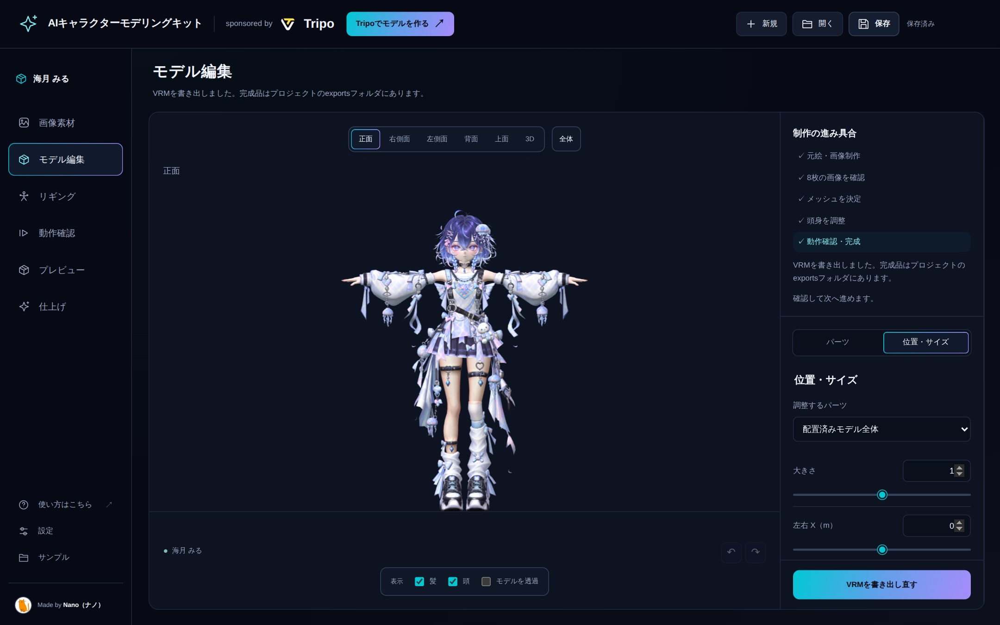</td>
    <td width="50%">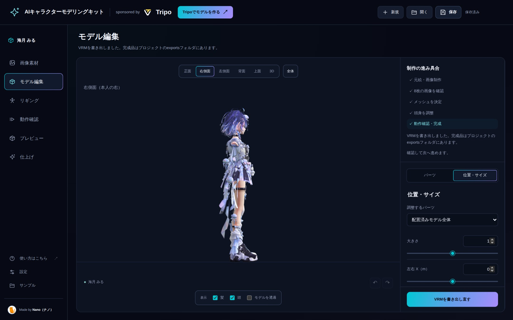</td>
  </tr>
</table>

<sub>※ 画像は完成後のプロジェクトで撮影しているため、調整するパーツが「配置済みモデル全体」になっています。このステップでは「頭」「髪」「体」を選んで調整します。</sub>

**🤖 エージェントの作業**

- 髪を外した頭と体を Tripo でリギングし、骨の位置だけを読み込みます。見た目のメッシュとテクスチャはそのまま使います。
- 同梱の素体からウェイトを移し、肩・肘・膝などの曲がり方を確認します。
- 髪を戻し、髪やスカート、リボンなどの揺れものを設定します。
- 確認用のモデルを登録し、動作確認のところで止まります。

## 6. 動きを確認する

**👤 あなたの操作**

1. **動作確認** を開きます。「ウォーク」のモーションが選ばれています。
2. **再生** で歩かせ、**元の姿勢** で T ポーズに戻ります。スライダーで歩行の途中の姿勢を止めて見ることもできます。
3. 正面と側面から、肩・肘・膝・首の曲がり方、衣装の破綻やめり込みがないかを見ます。気になる点があればチャットで伝えます。
4. 問題がなければ、右下の **動きを確認して次へ** を押し、依頼文をチャットに送ります。

<p align="center"></p>

> [!IMPORTANT]
> この画面で確かめられるのは、骨と体の動きです。髪や衣装の揺れ（物理）は、書き出した VRM で確認します。

**🤖 エージェントの作業**

- VRM に入れるモデル名・作者・利用条件を確認します。まだ伝えていなければ、ここで聞かれます。
- `exports/avatar.vrm` と、編集用の `exports/avatar.blend` を書き出します。
- 書き出した VRM を読み込み直して、揺れものが実際に動くかを確認します。確認できなかった項目は、残りの課題として報告されます。

<p align="center">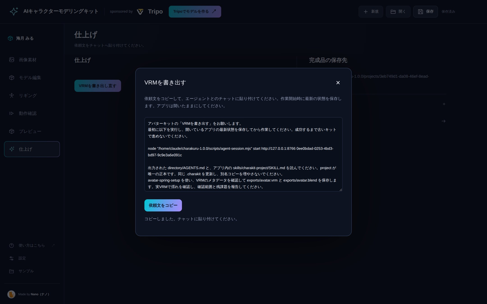</p>

## 7. 完成したVRMを確かめる

**👤 あなたの操作**

1. **仕上げ** の画面に **完成品の保存先**（`exports` フォルダ）が表示されます。ここに `avatar.vrm` と `avatar.blend` があります。
2. **プレビュー** を開き、**完成VRMを読み込む** で `avatar.vrm` を選びます。揺れものの物理が有効になります。
3. **VRMAを読み込む** で手持ちのモーションファイル（VRMA）を選ぶと、**再生・停止** で動きを確認できます。
4. **トゥーン** と **元の表示** の切り替えや、ライトの向き・明るさで見え方を確かめられます。

<table>
  <tr>
    <td width="50%">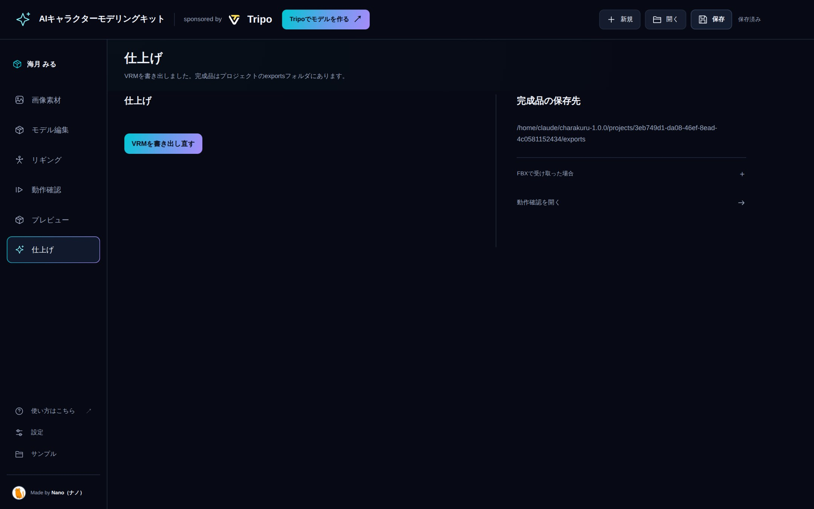</td>
    <td width="50%">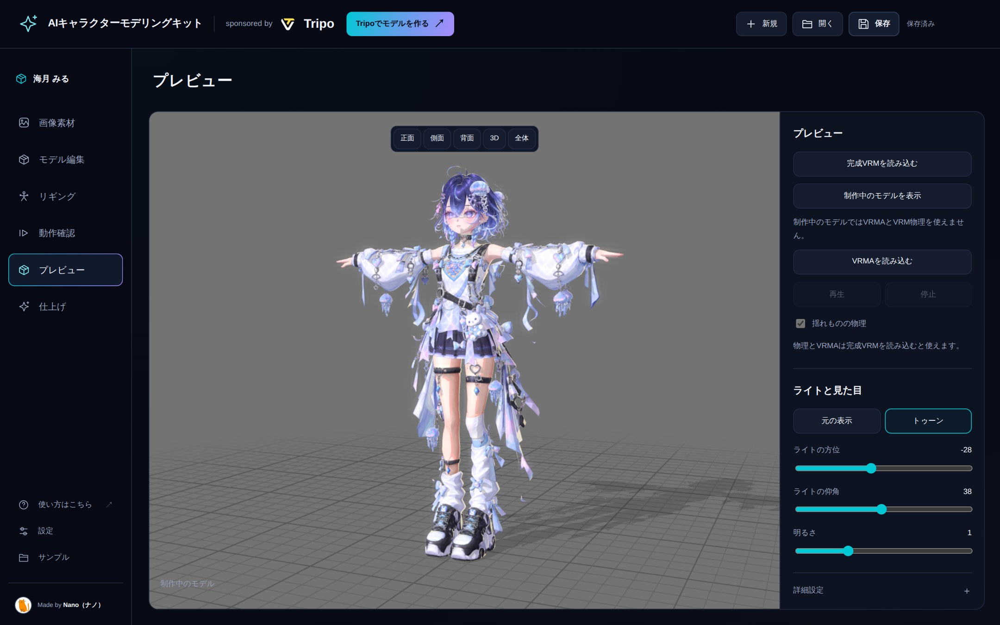</td>
  </tr>
</table>

<sub>※ プレビューの画像は「制作中のモデルを表示」で撮影しています。完成VRMを読み込むと、VRMAの再生と揺れものの物理が使えます。</sub>

プレビューでの見た目の調整は、確認のためのものです。VRM の中身は変わりません。設定は **設定JSONを保存** で別に残せます。VRM を書き出し直したいときは、仕上げ画面の **VRMを書き出し直す** から依頼します。

これで1体目の完成です。

---

## 保存と再開

- 依頼文を渡してエージェントが作業を始めるとき、アプリの最新の状態が自動で保存されます。それ以外のタイミングで残したいときは、右上の **保存** を押します。
- 同じフォルダからアプリを起動し直すと、前回のプロジェクトが開きます。
- **設定** で、プロジェクトの保存先の確認と、**持ち出し用に書き出す** ができます。
- 前の段階は左のメニューから見に戻れます。見るだけではやり直しになりません。画像や候補、配置を変えた場合は、それに続く段階をもう一度進めます。
- 別のパソコンに移すときは、`project.charakit` だけでなく、`exports` などの入った制作フォルダごと保管してください。

<p align="center">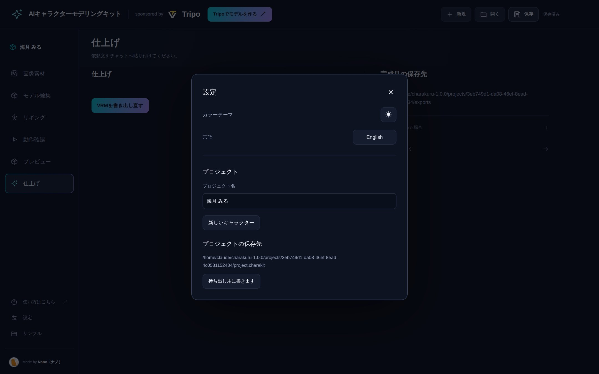</p>

## 困ったとき

### Windows の Codex で開始コマンドが拒否される

Windows の Codex では、旧形式の `agent-session.mjs start URL REQUEST_ID` にある `start` とURLが、PowerShellのURL起動命令と誤判定されることを確認しました。このキットでは開始命令を `begin` に変更し、新しい依頼文でその誤判定を避けています。この問題のためにCodexの権限設定を変更する必要はありません。保存・入力照合・制作開始の条件は従来と同じです。

1. 古い `start` の依頼文で拒否された場合は、更新済みキットでアプリを開き、使う元絵やプロジェクトを確認してください。
2. アプリから依頼文をコピーし直し、チャットへ送ります。新しい依頼文の開始コマンドは `agent-session.mjs begin` です。アプリは開いたままにしてください。
3. エージェントが開始コマンドの成功と `saved: true` を確認すると、アプリの最新状態が保存され、制作へ進みます。アプリの再起動や元絵の変更で依頼が失効した場合は、画面の内容を確認して依頼文をコピーし直します。手動保存や別名のキット作成は不要です。

この対応は [Issue #2](https://github.com/nanocle/Charakuru/issues/2)・[Issue #3](https://github.com/nanocle/Charakuru/issues/3)と同じ拒否の再現調査に基づきます。Codexの[Windows向け判定コード](https://github.com/openai/codex/blob/rust-v0.162.0-alpha.2/codex-rs/shell-command/src/command_safety/windows_dangerous_commands.rs)でも、命令と引数を区別せず `start` とURLの組み合わせを検出する処理を確認しています。旧形式の `start` は互換用に残していますが、新しい依頼では `begin` を使います。`begin` でも起動前に拒否される場合は開始処理が未実行です。再試行を繰り返さず、キットの版、Windows・Codexの版、選んだ権限設定、個人パスなどを省いたエラーの要点を添えて報告してください。

### その他

- **依頼文を送ったのに何も起きない**：依頼文はチャットに貼って送る必要があります。アプリが開いたままか確認してください。
- **途中で止まった・失敗した**：画面に理由が表示されます。**現在の状態を読み直す** で保存された状態を開き直せます。
- **Tripo のダウンロードがブラウザーに止められた**：エージェントが、どのファイルを手動で保存すればよいかを伝えます。その操作だけ行ってください。
- **不具合を見つけた**：[報告方法](../CONTRIBUTING.md) に沿って [Issues](https://github.com/nanocle/Charakuru/issues) へお願いします。
