# Tutorial: make your first VRM avatar

[README](../README.md) · [日本語](tutorial.ja.md)

> [!WARNING]
> **This kit is still in development.**
>
> Some documentation hasn't caught up yet, and there are bugs and missing features. Thank you for your understanding.
>
> **These docs were written by AI.**
>
> They can be a little hard for people to read. We recommend opening the extracted distribution ZIP folder in a coding agent such as Codex or Claude Code, and learning about the kit by talking with the agent.
>
> For example: "Read README.md and AGENTS.md and tell me what this kit can do."

This tutorial walks through the whole process, from one illustration to a finished VRM avatar. The example character is 海月 みる (Miru Umitsuki).

Each step has two parts:

- **👤 What you do**: buttons to press and things to look at in the app. Follow them in order.
- **🤖 What the agent does**: what the agent works on after you hand over the request. This is just for reading.

<p align="center"></p>

## Contents

0. [What to prepare](#0-what-to-prepare)
1. [Start the kit](#1-start-the-kit)
2. [Load the illustration and request 8 images](#2-load-the-illustration-and-request-8-images)
3. [Review the 8 images](#3-review-the-8-images)
4. [Choose the head and body 3D candidates](#4-choose-the-head-and-body-3d-candidates)
5. [Adjust the proportions](#5-adjust-the-proportions)
6. [Check the motion](#6-check-the-motion)
7. [Check the finished VRM](#7-check-the-finished-vrm)
- [Saving and resuming](#saving-and-resuming) · [Troubleshooting](#troubleshooting)

---

## 0. What to prepare

Set up the tools listed under [What you need](../README.md#what-you-need) in the README. The agent checks your setup in step 1, so you can start even if something is missing.

Two more things make the process smoother:

- **The illustration**: PNG / JPEG / WebP, up to 20 MB. A full-body picture showing hairstyle, outfit and shoes works best. A character sheet with a close-up of the face or a back view is fine too. Use an illustration you are allowed to use.
- **Information for the VRM**: model name, author name and usage terms (whether others may use it, commercial use, redistribution, modification). The agent asks for these in the last step.

## 1. Start the kit

**👤 What you do**

1. Download `charakuru-1.0.2-….zip` from [Releases](https://github.com/nanocle/Charakuru/releases) and extract it to a folder you can write to. Not the "Source code" ZIP.
2. Open the extracted folder in Codex and ask:
   ```text
   Read the root AGENTS.md and help me start creating a character with this kit.
   ```
3. When the agent has started the app, open `http://127.0.0.1:8766` in your browser.

**🤖 What the agent does**

It reads `AGENTS.md` and checks whether Node.js, image generation, browser control, Blender and the rest are available. If something is missing, it tells you. Then it starts the app. When opening the app or Tripo, it uses your existing browser and tabs. If the page is not open, it adds a tab in the same browser; it starts a new browser only when none is open. If browser control needs a connection, it asks you to connect that browser.

<p align="center">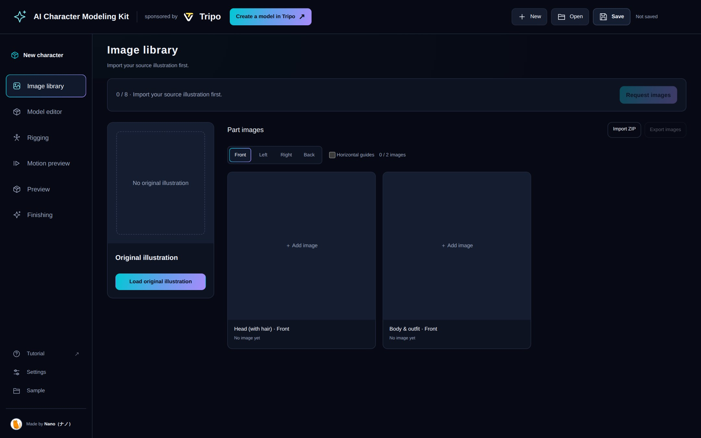</p>

The menu on the left shows the stages, from top to bottom: **Image library → Model editor → Rigging → Motion preview → Preview → Finishing**. **New / Open / Save** at the top right handle the project.

> [!TIP]
> To start the app yourself, run `npm start` in the extracted folder. No `npm install` is needed. To switch the UI to Japanese, open **Settings** at the bottom left and press 「日本語」 under **Language**.

### How to send a request (same for every step)

Every step below uses the same routine.

1. Press the step's continue button (for example **Request images** at the top right). A request window opens.
2. Press **Copy prompt**.
3. Paste it into your Codex chat and send it. **Copying alone does not start the agent.**
4. Keep the app open while the agent works. Its progress appears under the page heading.
5. When it's done, the app shows "Work is ready for your review." and switches to the new state on its own.

<p align="center">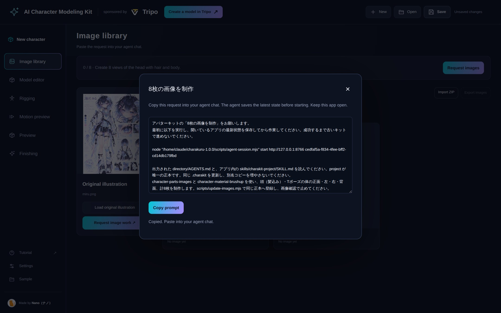</p>

> [!NOTE]
> The request text is written in Japanese even when the UI is in English. Paste it as is; the agent reads it either way, and you can keep chatting in English.

## 2. Load the illustration and request 8 images

**👤 What you do**

1. Open **Image library** in the left menu.
2. In the illustration area, press **Load original illustration** and choose your file.
3. Press **Request images** (top right) or **Request image work ↗** (below the illustration), copy the request and send it in the chat.

<p align="center">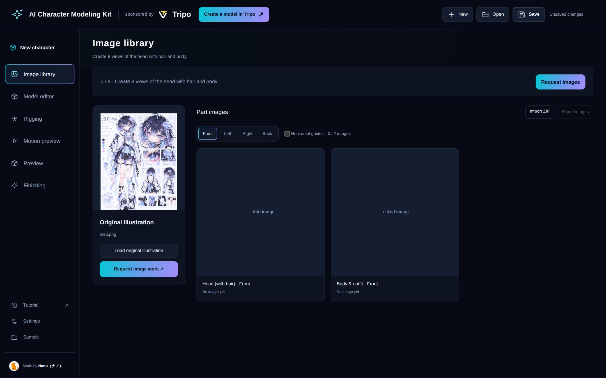</p>

**🤖 What the agent does**

Based on the illustration, it paints the **head (with hair)** and the **body with the outfit**, each from four views: front, left, right and back. That makes 8 images.

- The head is straightened, with a calm, closed-mouth expression.
- The body is posed in a T-pose with arms out to the sides.
- Hair, skin and clothing are painted to the same level of finish as a completed character illustration.
- Each image is added to the project together with the prompt used for it.

<p align="center">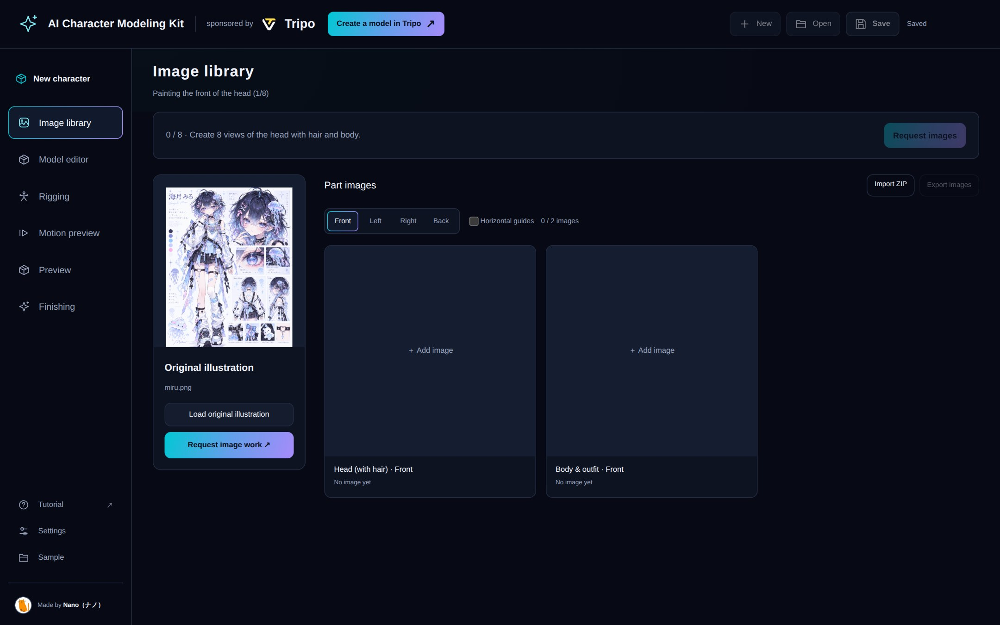</p>

## 3. Review the 8 images

**👤 What you do**

1. When the agent is done, the head and body images appear side by side. Use **Front / Left / Right / Back** at the top to switch views and look at all 8.
2. Check for anything off, for example:
   - Do the hair length, tips and accessories match the illustration?
   - Do the outfit's patterns, colors and asymmetric parts sit in the right places?
   - Is any body showing in the head images, or any back hair left in the body images?
3. To fix a single image, click it to enlarge it and press **Astraに修正を依頼** (request a fix). Copy the request, paste it into the chat, **add what you want changed and where**, then send it.
4. When all 8 look right, press **Confirm images & continue** and send the request in the chat.

<p align="center"></p>

<table>
  <tr>
    <td width="50%">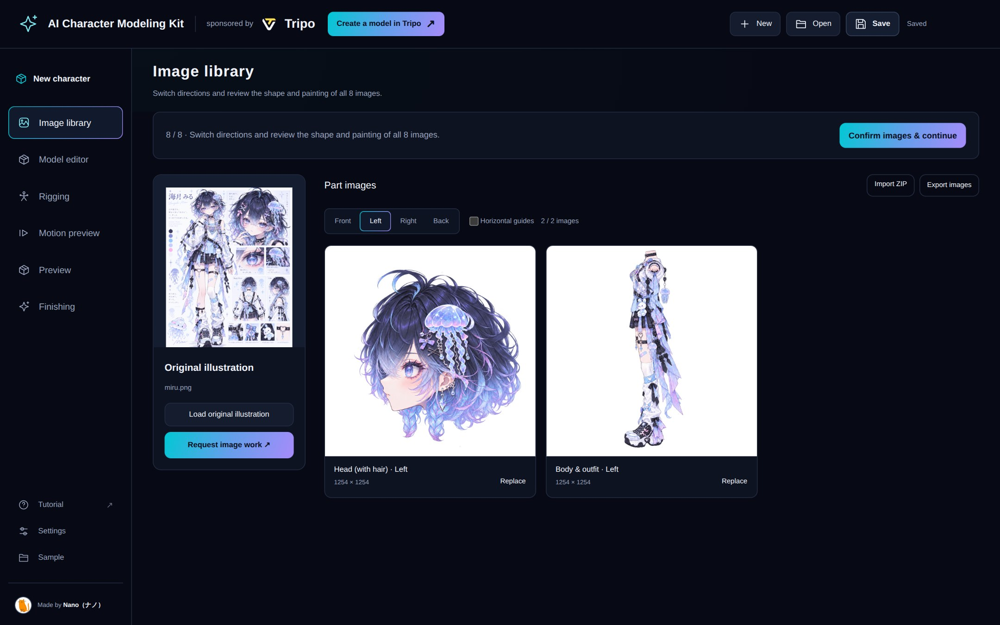</td>
    <td width="50%">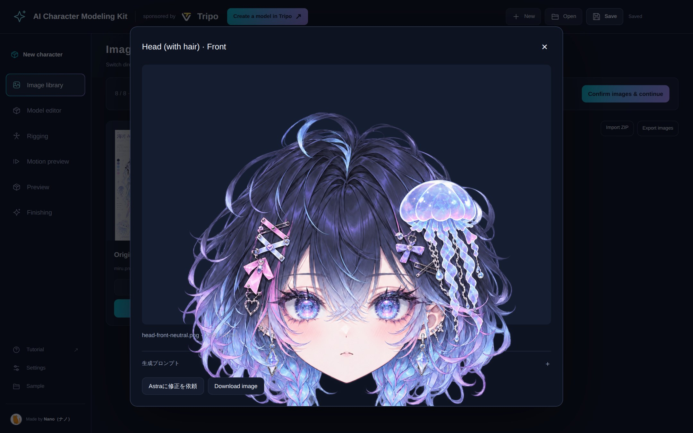</td>
  </tr>
  <tr>
    <td><sub>Switched to the "Left" view</sub></td>
    <td><sub>Click to enlarge. You can request a fix for this one image from here</sub></td>
  </tr>
</table>

> [!NOTE]
> You can also use **Replace** on any image to swap in one you made yourself.

**🤖 What the agent does**

It operates Tripo in the browser and generates **four 3D candidates each for the head and the body** from the four views. It downloads the candidates, adds them to the project and stops for you to choose. Tripo credits start being used from this stage.

## 4. Choose the head and body 3D candidates

**👤 What you do**

1. The candidates appear in **Model editor**. In the bottom panel, choose **Head** and switch between numbers **1–4** to compare them.
2. Drag to rotate, or use **Front / Right / Left / Back / Top / 3D** at the top to change the view. Turn on **Wireframe** to see how dense the mesh is.
3. With the best candidate showing, press **Select this candidate**.
4. Switch to **Body** and choose one the same way.
5. When both head and body show "Selected" under **Choose meshes** on the right, press **Confirm meshes & continue** and send the request in the chat.

<table>
  <tr>
    <td width="50%">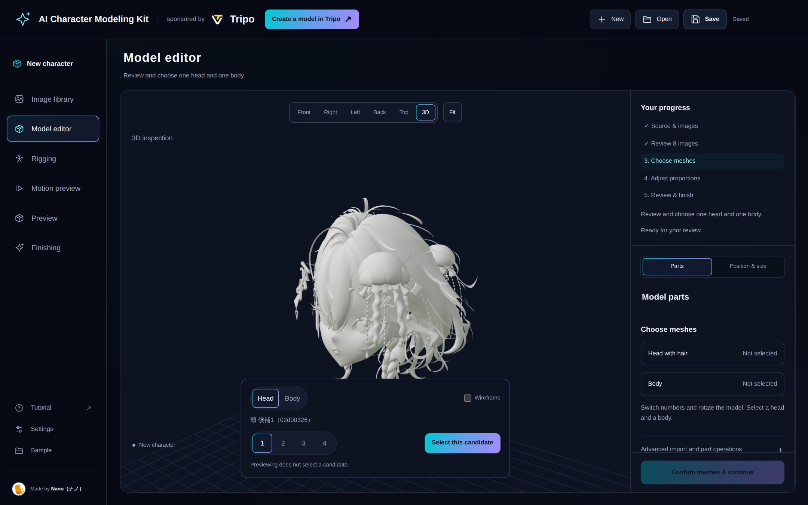</td>
    <td width="50%"></td>
  </tr>
  <tr>
    <td><sub>Switch numbers to compare candidates</sub></td>
    <td><sub>Continue once both head and body show "Selected"</sub></td>
  </tr>
</table>

> [!NOTE]
> Viewing a candidate does not select it. Only the one you press **Select this candidate** on is used.

**🤖 What the agent does**

It prepares the chosen head and body for finishing.

- Splits the parts in Tripo and sorts them into face, hair, outfit and so on.
- Groups the textures into up to seven sets and paints a reference image for each.
- Unwraps the UVs in Tripo and rebuilds the textures at 4K.
- Assembles the parts and adds them to the project.

If some shapes are joined and can't be separated, the agent shows you the spot in an image and asks how to proceed. Answer in the chat.

<p align="center">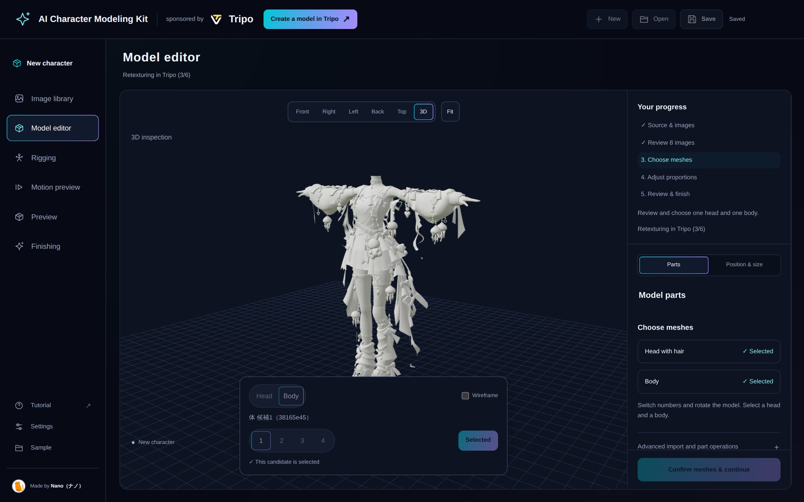</p>

## 5. Adjust the proportions

**👤 What you do**

1. In **Model editor**, open the **Position & size** tab.
2. Under **Part to adjust**, choose head, hair or body and use the scale and position sliders. Turn on **Move hair together with the head** to move them together.
3. Switch between the front and right views to check the neck joint and head size. ↶ ↷ undo and redo.
4. If needed, enter **Target total height (m)** and press **Apply height** to set the overall size. The 1.7 m shown is an example, not a VRM requirement.
5. When you're happy, press **Confirm proportions & continue** and send the request in the chat.

<table>
  <tr>
    <td width="50%">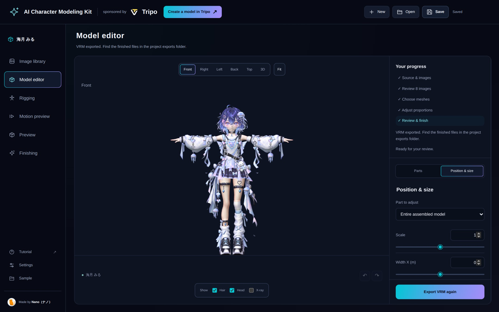</td>
    <td width="50%">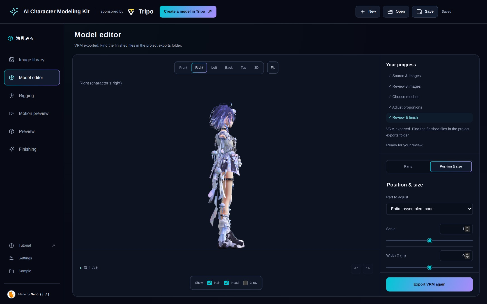</td>
  </tr>
</table>

<sub>These screenshots were taken from the finished project, so the part to adjust shows the whole assembled model. In this step you choose head, hair or body instead.</sub>

**🤖 What the agent does**

- Rigs the head (without hair) and body in Tripo and imports only the bone positions. The visible mesh and textures stay as they are.
- Transfers weights from the bundled base body and checks how shoulders, elbows and knees bend.
- Puts the hair back and sets up physics for hair, skirt, ribbons and other swinging parts.
- Adds a review model to the project and stops at the motion check.

## 6. Check the motion

**👤 What you do**

1. Open **Motion preview**. The **Walk** motion is selected.
2. Press **Play** to make the model walk, and **Rest pose** to return to the T-pose. You can also stop at any point of the walk with the slider.
3. From the front and the side, look at how shoulders, elbows, knees and neck bend, and whether the outfit breaks or clips. If something bothers you, say so in the chat.
4. When it looks fine, press **Confirm motion & continue** at the bottom right and send the request in the chat.

<p align="center"></p>

> [!IMPORTANT]
> This screen shows how the bones and body move. Hair and outfit physics are checked in the exported VRM.

**🤖 What the agent does**

- Confirms the model name, author and usage terms for the VRM. If you haven't given them yet, it asks now.
- Exports `exports/avatar.vrm` and the editable `exports/avatar.blend`.
- Loads the exported VRM again to check that the physics actually move. Anything it couldn't verify is reported as a remaining issue.

<p align="center">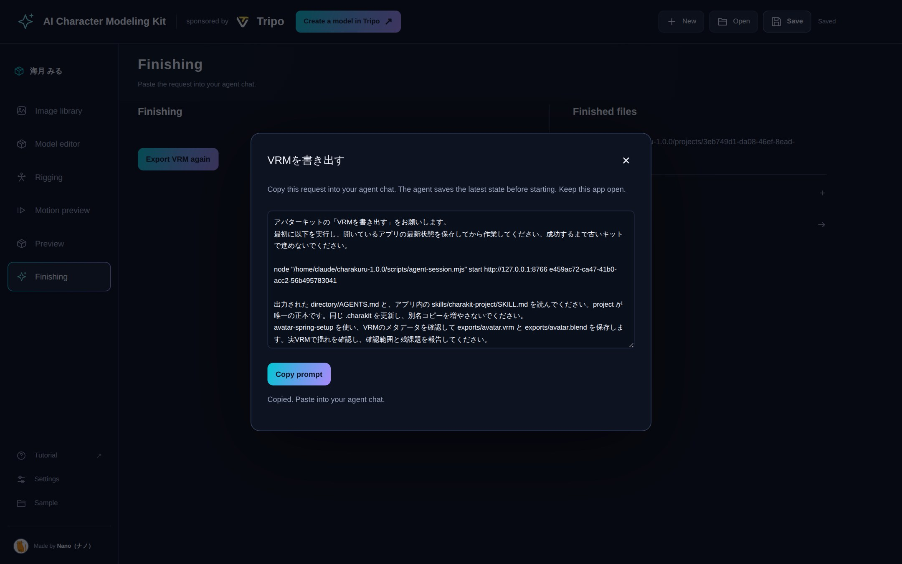</p>

## 7. Check the finished VRM

**👤 What you do**

1. **Finishing** shows **Finished files**, the `exports` folder that holds `avatar.vrm` and `avatar.blend`.
2. Open **Preview** and choose `avatar.vrm` with **Load finished VRM**. This turns on the hair and outfit physics.
3. Choose a motion file (VRMA) with **Load VRMA**, then use **Play / Stop** to watch it move.
4. Switch between **Toon** and **Original view**, and change the light direction and brightness to see how it looks.

<table>
  <tr>
    <td width="50%">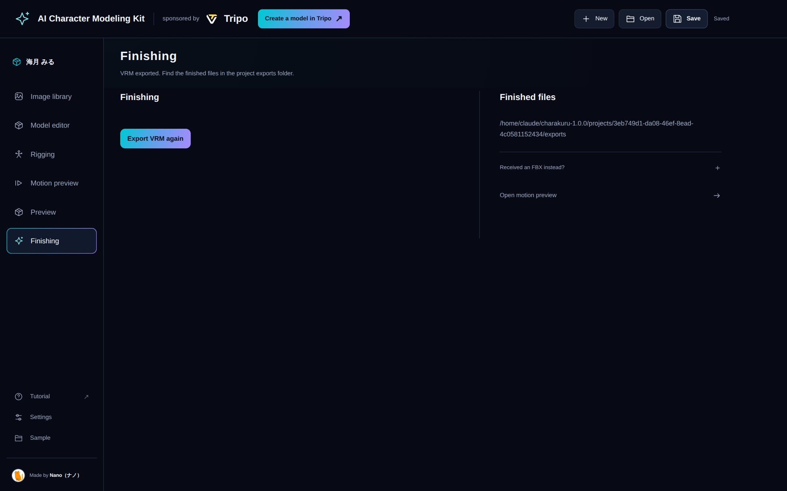</td>
    <td width="50%">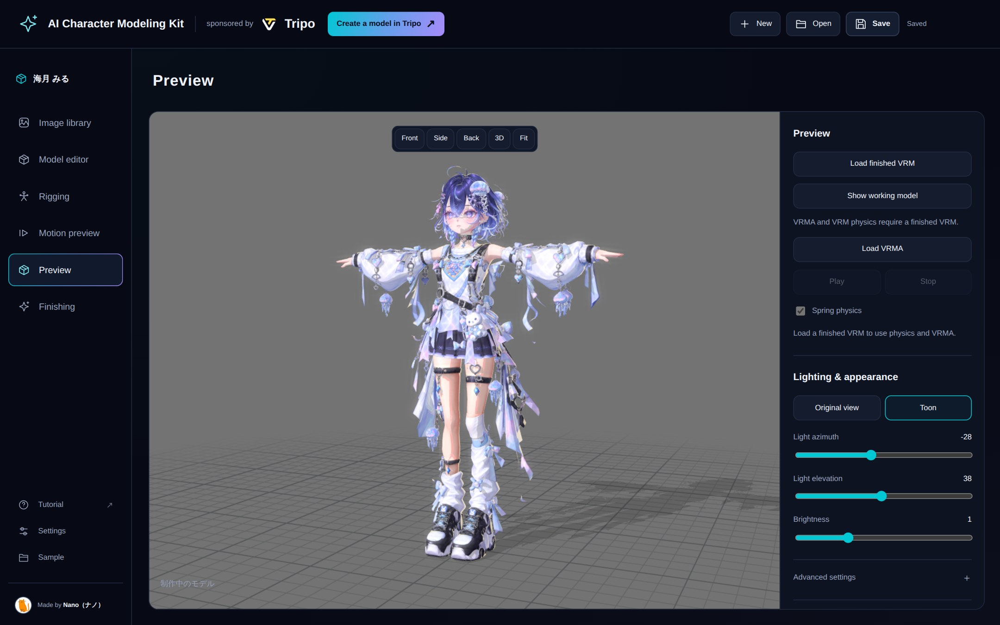</td>
  </tr>
</table>

<sub>The preview screenshot uses **Show working model**. Loading the finished VRM enables VRMA playback and physics.</sub>

Adjustments in Preview are for viewing only and don't change the VRM. You can keep them separately with **Save settings JSON**. To export the VRM again, use **Export VRM again** on the Finishing screen.

That's your first avatar done.

---

## Saving and resuming

- When you hand over a request and the agent starts work, the app's current state is saved automatically. To save at other times, press **Save** at the top right.
- Starting the app again from the same folder reopens the last project.
- In **Settings**, you can check the **Project location** and **Export a portable copy**.
- You can go back to earlier stages from the left menu. Just looking doesn't undo anything. If you change images, candidates or placement, the stages after it need to run again.
- When moving to another computer, keep the whole project folder, including `exports`, not just `project.charakit`.

<p align="center">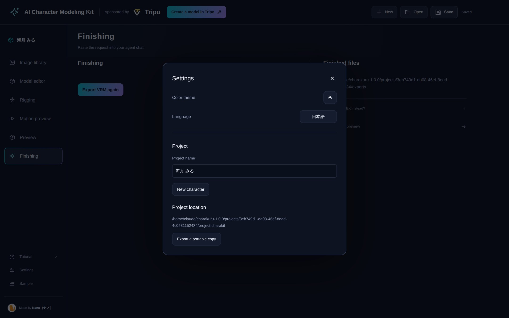</p>

## Troubleshooting

### A start command is blocked by policy in Codex on Windows

We reproduced Codex on Windows mistaking the `start` argument and URL in the old `agent-session.mjs start URL REQUEST_ID` command for a PowerShell URL launch. This kit uses `begin` in new requests to avoid that false positive. You do not need to change Codex permissions for this issue. Saving, input validation and the conditions for starting work are unchanged.

1. If an old request using `start` was rejected, open the app from the updated kit and check the source image or project you want to use.
2. Copy a new request from the app and send it in chat. Its start command is `agent-session.mjs begin`. Keep the app open.
3. Once the agent confirms success and `saved: true`, the app saves its latest state and work can begin. If restarting the app or changing the source image invalidated the request, review the app and copy a new request. You do not need to save manually or create another kit file.

This change follows a reproduction of the same rejection reported in [Issue #2](https://github.com/nanocle/Charakuru/issues/2) and [Issue #3](https://github.com/nanocle/Charakuru/issues/3). Codex's [Windows classifier](https://github.com/openai/codex/blob/rust-v0.162.0-alpha.2/codex-rs/shell-command/src/command_safety/windows_dangerous_commands.rs) also checks for `start` and a URL without distinguishing command names from arguments. The old `start` command remains a compatibility alias, but new requests use `begin`. If `begin` is also rejected before launch, the kit's start operation has not run. Stop retrying and report the kit version, Windows and Codex versions, selected permissions setting, and the error summary with personal paths removed.

### Other issues

- **Nothing happens after sending a request**: the request has to be pasted into the chat and sent. Make sure the app is still open.
- **The work stopped or failed**: the reason is shown on screen. **Reload saved project** reopens the saved state.
- **The browser blocked a Tripo download**: the agent tells you which file to save by hand. Do just that.
- **You found a bug**: please report it through [Issues](https://github.com/nanocle/Charakuru/issues), following [the reporting guide](../CONTRIBUTING.md).
